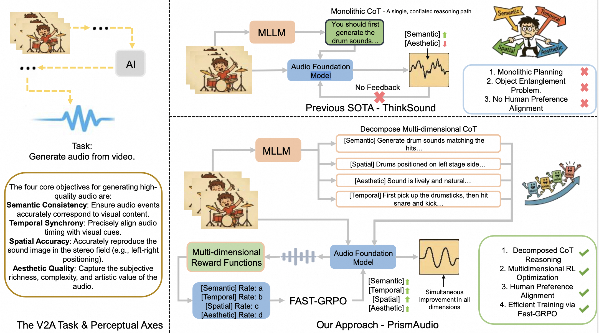
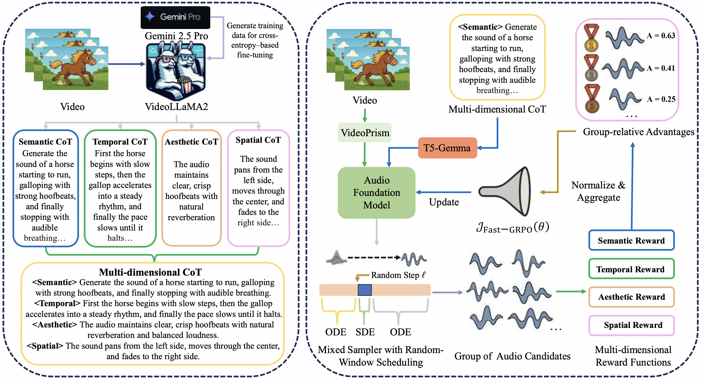

<h1 align="center">PrismAudio</h1>


<p align="center">
  
</p>

<p align="center">
  <a href="https://arxiv.org/abs/2511.18833">
    
  </a>
  &nbsp;
  <a href="http://prismaudio-project.github.io/">
    
  </a>
  &nbsp;
  <a href="https://huggingface.co/spaces/mahshid1378/PrismAudio">
    
  </a>
  &nbsp;
  <a href="https://www.modelscope.cn/studios/iic/PrismAudio">
    
  </a>
</p>

<p align="center">
  If you find this project useful,<br>
  a star ⭐ on GitHub would be greatly appreciated!
</p>


---

**PrismAudio** is the first framework to integrate Reinforcement Learning into Video-to-Audio (V2A) generation with specialized Chain-of-Thought (CoT) planning. Building upon [ThinkSound](https://arxiv.org/pdf/2506.21448)'s pioneering CoT-based V2A framework, PrismAudio further decomposes monolithic reasoning into four specialized CoT modules (Semantic, Temporal, Aesthetic, and Spatial), each paired with targeted reward functions, enabling multi-dimensional RL optimization that jointly improves reasoning across all perceptual dimensions.




---

## 📰 News
- **2026.03.24** &nbsp; 🔥 We have released **PrismAudio**, our next-generation video-to-audio generation model! Model weights are available on [Hugging Face](https://huggingface.co/mahshid1378/PrismAudio) and [ModelScope](https://www.modelscope.cn/models/iic/PrismAudio). For more details, please refer to the [`prismaudio`](https://github.com/liuhuadai/ThinkSound/tree/prismaudio) branch!
- **2026.01.26** &nbsp; 🎉 PrismAudio has been accepted to the **ICLR 2026 Main Conference**! We plan to release the project in February 2026.
- **2025.11.25** &nbsp; 🔥 [Online PrismAudio Demo](http://prismaudio-project.github.io/) is live - try it now!
- **2025.11.25** &nbsp; 🔥 [PrismAudio paper](https://arxiv.org/pdf/2511.18833) released on arXiv, the first multi-dimensional CoT-RL framework for Video-to-Audio Generation!
- **2025.09.19** &nbsp; 🎉 ThinkSound has been accepted to the **NeurIPS 2025 Main Conference**!
- **2025.09.01** &nbsp; Our AudioCoT dataset is now open-sourced and available on [Hugging Face](https://huggingface.co/datasets/liuhuadai/AudioCoT)!
- **2025.07.17** &nbsp; 🧠 Finetuning enabled: training and finetuning code is now publicly available, along with clear usage instructions to help you customize and extend ThinkSound with your own data.
- **2025.07.15** &nbsp; 📦 Simplified installation and usability: dependencies on PyPI for easy cross-platform setup; Windows `.bat` scripts automate environment creation and script running.
- **2025.07.08** &nbsp; 🔧 Major update: model lightweighted and optimized memory and GPU usage, now supports high-throughput audio generation at scale!
- **2025.07.01** &nbsp; Online demo on [Hugging Face Spaces](https://huggingface.co/spaces/FunAudioLLM/ThinkSound) and [ModelScope](https://modelscope.cn/studios/iic/ThinkSound) for interactive experience!
- **2025.07.01** &nbsp; Released inference scripts and web interface.
- **2025.06** &nbsp; [ThinkSound paper](https://arxiv.org/pdf/2506.21448) released on arXiv!
- **2025.06** &nbsp; [Online Demo](http://thinksound-project.github.io/) is live - try it now!

---

## 🚀 Features

- **V2A SOTA**: Achieves state-of-the-art results across all four perceptual dimensions on both VGGSound and AudioCanvas benchmarks.
- **Decomposed CoT Reasoning**: Four specialized CoT modules (Semantic, Temporal, Aesthetic, Spatial) each providing focused, interpretable reasoning for its corresponding perceptual dimension.
- **Multi-dimensional RL**: Fast-GRPO enables efficient multi-dimensional reward optimization without compromising generation quality.
- **New Benchmark**: AudioCanvas — a rigorous V2A benchmark with 300 single-event classes and 501 multi-event samples covering diverse and challenging scenarios.
- **Efficient**: 518M parameters with faster inference than prior SOTAs.

---

## ✨ Method Overview

PrismAudio consists of three main components:

1. **CoT-Aware Audio Foundation Model**: Built on a Multimodal Diffusion Transformer with flow matching, enhanced with VideoPrism for video understanding and T5-Gemma for structured CoT text encoding.
2. **Decomposed Multi-Dimensional CoT Reasoning**: Four specialized CoT modules — Semantic, Temporal, Aesthetic, and Spatial — each providing targeted reasoning for its corresponding perceptual dimension.
3. **Fast-GRPO Multi-Dimensional RL Framework**: A hybrid ODE-SDE sampling strategy that dramatically reduces training overhead while enabling multi-dimensional reward optimization across all perceptual dimensions.



---

## ⚡ Quick Start

```bash
git clone -b prismaudio https://github.com/liuhuadai/ThinkSound.git
cd ThinkSound

conda create -n prismaudio python=3.10
conda activate prismaudio
chmod +x scripts/PrismAudio/setup/build_env.sh
./scripts/PrismAudio/setup/build_env.sh

# Download pretrained weights to Directory ckpts/
# From Hugging Face: https://huggingface.co/liuhuadai/ThinkSound
# From ModelScope:   https://www.modelscope.cn/models/iic/ThinkSound
git lfs install
git clone https://huggingface.co/mahshid1378/PrismAudio ckpts
```

---

## ▶️ Run Demo

```bash
chmod +x scripts/PrismAudio/demo.sh
./scripts/PrismAudio/demo.sh <path-to-your-demo-video> "<CoT description>"
```

**Note:**
- `<path-to-your-demo-video>`: Path to a single input video file.
- `"<CoT description>"`: A structured CoT description of the audio to generate.

---

## 🏋️ Train the Model

See [`Training.md`](docs/PrismAudio/Training.md)

---

## 📄 License

This project is released under the Apache 2.0 License.

> **Note:**
> The code, models, and dataset are **for research and educational purposes only**.
> **Commercial use is NOT permitted.**
> For commercial licensing, please contact the authors.

## 📦 Third-Party Components (Reward Models)

Our Reinforcement Learning (RL) framework utilizes a multi-objective reward system, integrating the following specialized models as objective reward functions:

* **Stable Audio Open VAE** (by **Stability AI**): Serves as the foundational latent space for audio generation and reconstruction. Licensed under the [Stability AI Community License](./third_party/LICENSE_StabilityAI.md). **Commercial use and redistribution require prior permission from Stability AI.**
* **Semantic Reward Model (Microsoft CLAP)**: Based on [Microsoft CLAP](https://github.com/microsoft/CLAP), this model provides a semantic consistency reward by calculating the cosine similarity between generated audio embeddings and text prompt embeddings.
* **Semantic Reward Model (LAION CLAP, optional)**: Based on [LAION-AI CLAP](https://github.com/LAION-AI/CLAP), used as an alternative or ensemble semantic scorer to reduce reward hacking during the RL process.
* **Temporal Synchronization Reward (Synchformer)**: Based on [Synchformer](https://github.com/v-iashin/Synchformer), this model provides a synchronization reward, evaluating the rhythmic and temporal alignment between generated audio and visual/textual cues.
* **Aesthetic & Quality Reward (Audiobox)**: Based on [Audiobox Aesthetics](https://github.com/facebookresearch/audiobox-aesthetics) (Meta AI), providing a perceptual quality reward to guide the agent toward generating high-fidelity and "aesthetically pleasing" audio.
* **Spatial Consistency Reward (StereoCRW)**: Based on [StereoCRW](https://github.com/IFICL/stereocrw), specifically adapted for ITD (Interaural Time Difference) estimation to provide spatial rewards for binaural or stereo audio synthesis.

---

## 🙏 Acknowledgements

We sincerely thank the following research teams for open-sourcing their models and frameworks, which serve as critical reward signals in our RL pipeline:
* **flow_grpo (by yifan123)**: For providing the high-performance post-training framework that enables efficient Group Relative Policy Optimization (GRPO).
* **Stable Audio Tools (Stability AI)**: For the high-performance generative audio framework and the VAE module.
* **Microsoft Research & LAION-AI**: For the CLAP models, enabling robust semantic rewards for cross-modal alignment.
* **Vladimir Iashin and the Synchformer Team**: For providing a sophisticated method for temporal synchronization evaluation.
* **Meta AI (Audiobox Aesthetics Team)**: For their work on quantifying audio aesthetics, essential for perceptual quality optimization.
* **IFICL (StereoCRW Team)**: For the self-supervised spatial audio representations, which allow for precise spatial reward calculation.

## 📖 Citation

If you find PrismAudio useful in your research or work, please cite our paper:

```bibtex
@misc{liu2025prismaudiodecomposedchainofthoughtsmultidimensional,
          title={PrismAudio: Decomposed Chain-of-Thoughts and Multi-dimensional Rewards for Video-to-Audio Generation}, 
          author={Huadai Liu and Kaicheng Luo and Wen Wang and Qian Chen and Peiwen Sun and Rongjie Huang and Xiangang Li and Jieping Ye and Wei Xue},
          year={2025},
          eprint={2511.18833},
          archivePrefix={arXiv},
          primaryClass={cs.SD},
          url={https://arxiv.org/abs/2511.18833}, 
    }
```

---
